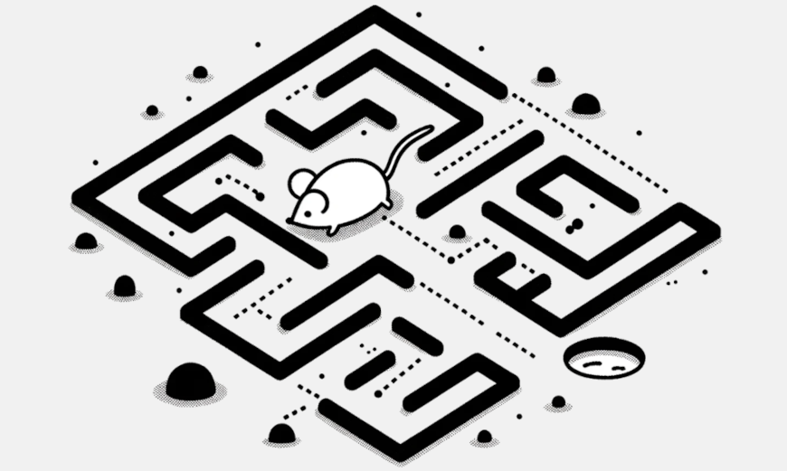

# ethology

[`ethology`](https://github.com/neuroinformatics-unit/ethology) is a Python package which aims to facilitate the application of a wide range of computer vision tasks to animal behaviour research, by providing a unified data analysis interface. We plan to support both classic computer vision tasks and deep learning based ones, such as background subtraction, object detection, ID tracking, segmentation, any-point tracking, and any useful combinations between them. 

::::{grid} 1 2 2 3
:gutter: 3

:::{grid-item-card} {fas}`wrench;sd-text-primary` Installation
:link: installation
:link-type: doc

Installation Instructions.
:::

:::{grid-item-card} {fas}`handshake-angle;sd-text-primary` Contributing
:link: community/contributing
:link-type: doc

Guidelines on How to Contribute.
:::

:::{grid-item-card} {fas}`handshake-angle;sd-text-primary` Join the Community
:link: community/index
:link-type: doc

How to get in touch and contribute.
:::
::::



## Overview

The main goal of `ethology` is to facilitate the application of a wide range of computer vision tasks to animal behaviour research, by providing a unified data analysis interface across these tasks.

Any-point tracking is a good example of a computer vision task that is maturing within the field of computer vision, but it still relatively inaccessible to animal behaviour researchers. The task consists on the following: given a video and a set of query points on a frame of that video, predict the location of those points on every other frame of the video. This is a more general problem than the pose estimation one, which typically focuses on predicting the location of a fixed set of keypoints on an animal’s body. As a result, any-point tracking tools could prove to be a very valuable tool for studying animal behaviour, with potential to supplement or potentially even replace pose estimation.

Depending on the quality of the trajectories generated by any-point trackers, these could be useful to study the movement patterns of animals directly, or they may be more helpful as a semi-automatic way to quickly generate labelled data. In recent years, there has been an increase in the development of any-point trackers, such as cotracker3 and TAPIR. The goal of this project is to add support for any-point trackers to ethology, so that users can easily apply these tools to their data and analyse the trajectories generated.


```{toctree}
:maxdepth: 2
:hidden:

installation
community/index
api_index
```
